# Jarkom_Modul2_LaporanResmi_B01
 
Kalian diminta untuk membuat sebuah website utama dengan
 
1. alamat http://semeruyyy.pw
 
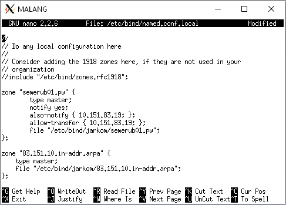
 
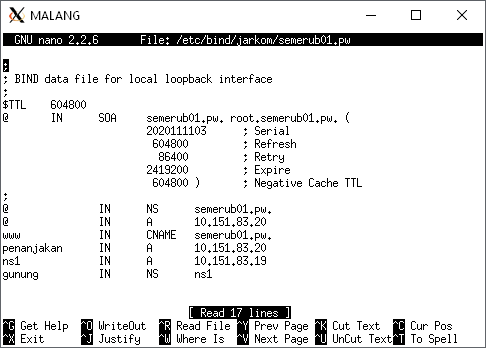
 
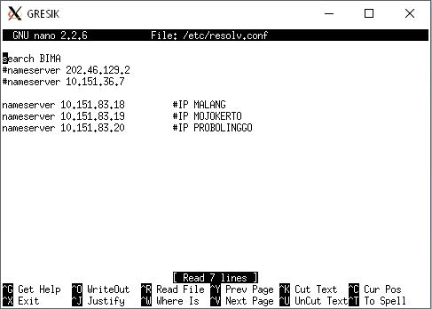
 
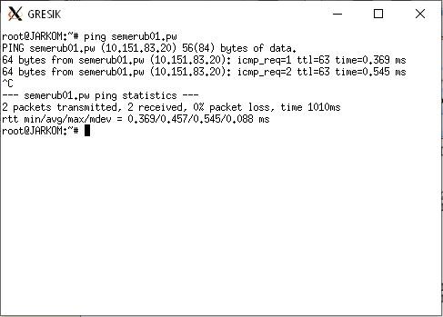
 
2. alias http://www.semeruyyy.pw
 

 
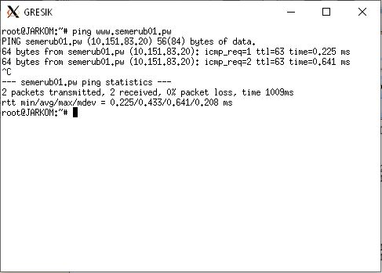
 
3. subdomain http://www.penanjakan.semeruyyy.pw yang diatur DNS-nya pada MALANG dan mengarah ke IP Server PROBOLINGGO
 

 
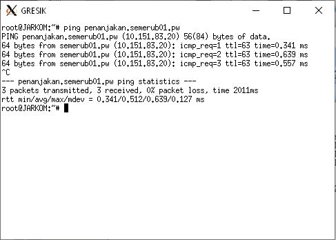
 
4. reverse domain untuk domain utama
 

 
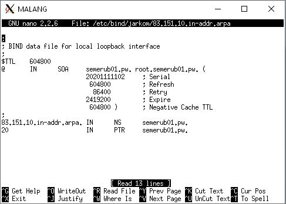
 
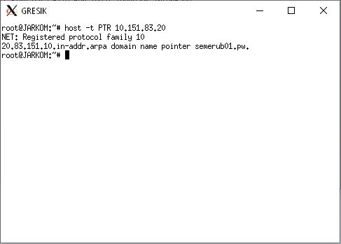
 
5. DNS Server Slave pada MOJOKERTO
 

 
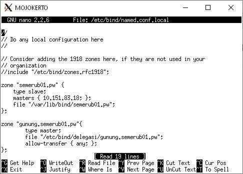
 
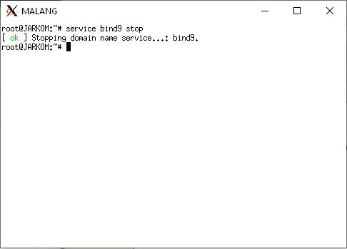
 
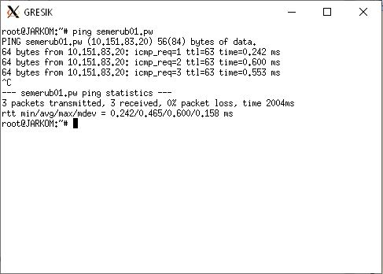
 
6. subdomain dengan alamat http://gunung.semeruyyy.pw yang didelegasikan pada server MOJOKERTO dan mengarah ke IP Server PROBOLINGGO
 

 
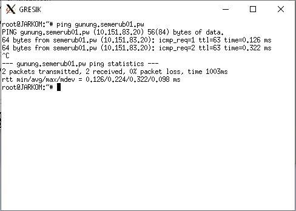
 
7. subdomain dengan nama http://naik.gunung.semeruyyy.pw domain ini diarahkan ke IP Server PROBOLINGGO
 
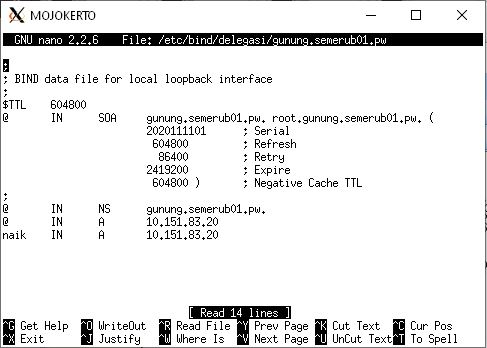
 
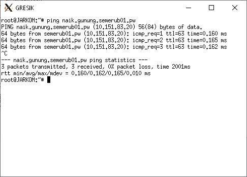
 
