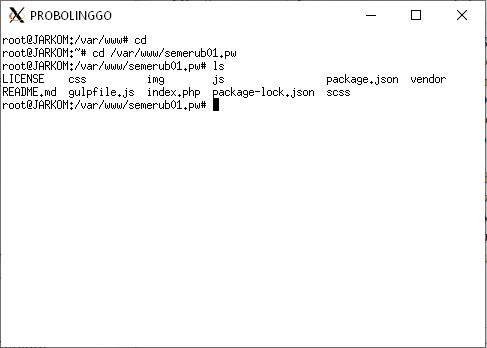
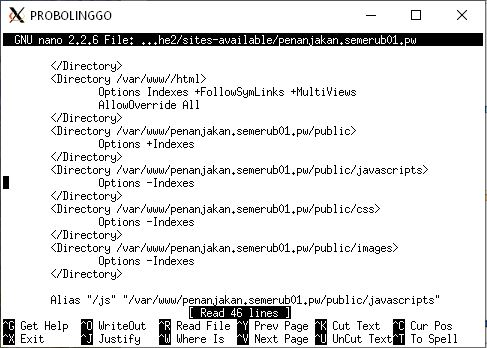
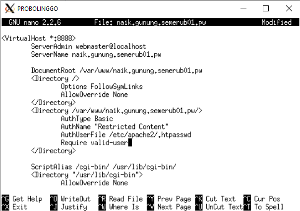
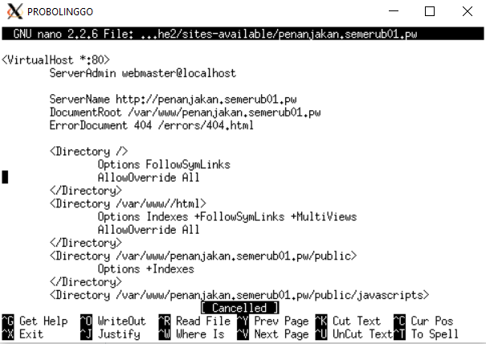

# Jarkom_Modul2_LaporanResmi_B01
 
Kalian diminta untuk membuat sebuah website utama dengan
 
1. alamat http://semeruyyy.pw
 

 

 

 

 
2. alias http://www.semeruyyy.pw
 

 

 
3. subdomain http://www.penanjakan.semeruyyy.pw yang diatur DNS-nya pada MALANG dan mengarah ke IP Server PROBOLINGGO
 

 

 
4. reverse domain untuk domain utama
 

 

 

 
5. DNS Server Slave pada MOJOKERTO
 

 

 

 

 
6. subdomain dengan alamat http://gunung.semeruyyy.pw yang didelegasikan pada server MOJOKERTO dan mengarah ke IP Server PROBOLINGGO
 

 

 

 
7. subdomain dengan nama http://naik.gunung.semeruyyy.pw domain ini diarahkan ke IP Server PROBOLINGGO
 

 

  
 
Setelah selesai membuat keseluruhan domain, kamu diminta untuk segera mengatur web server.
 
8. Domain http://semeruyyy.pw memiliki *DocumentRoot* pada /var/www/semeruyyy.pw. Awalnya web dapat diakses menggunakan alamat http://semeruyyy.pw/index.php/home.
 

  

  

  
9. Karena dirasa alamat urlnya kurang bagus, maka diaktifkan mod rewrite agar urlnya menjadi http://semeruyyy.pw/home
 

 

  
 10. Web http://penanjakan.semeruyyy.pw akan digunakan untuk menyimpan assets file yang memiliki *DocumentRoot* pada /var/www/penanjakan.semeruyyy.pw dan memiliki struktur folder sebagai berikut:
 
/var/www/penanjakan.semeruyyy.pw 
                                /public/javascripts 
                                /public/css 
                                /public/images 
                                /errors  
 

 

 
11. Pada folder /public dibolehkan directory listing namun untuk folder yang berada di dalamnya tidak dibolehkan.
 

 

 

 

 

 
12. Untuk mengatasi HTTP Error code 404, disediakan file 404.html pada folder /errors untuk mengganti error default 404 dari Apache.
 

 

 
13. Untuk mengakses file assets javascript awalnya harus menggunakan url http://penanjakan.semeruyyy.pw/public/javascripts. Karena terlalu panjang maka dibuatkan konfigurasi virtual host agar ketika mengakses file assets menjadi http://penanjakan.semeruyyy.pw/js.
 

 

 
14. sedangkan web http://naik.gunung.semeruyyy.pw sudah bisa diakses hanya dengan menggunakan port 8888. *DocumentRoot* berada pada /var/www/naik.gunung.semeruyyy.pw.
 
15. Bibah meminta kamu membuat web http://naik.gunung.semeruyyy.pw agar diberi autentikasi password dengan username “semeru” dan password “kuynaikgunung” supaya aman dan tidak sembarang orang bisa mengaksesnya.

16. Karena dirasa kurang profesional, maka setiap Bibah mengunjungi IP PROBOLINGGO akan dialihkan secara otomatis ke http://semeruyyy.pw.
 

 

 

 
17. Karena pengunjung pada /var/www/penanjakan.semeruyyy.pw/public/images sangat banyak maka semua request gambar yang memiliki substring “semeru” akan diarahkan menuju semeru.jpg.

